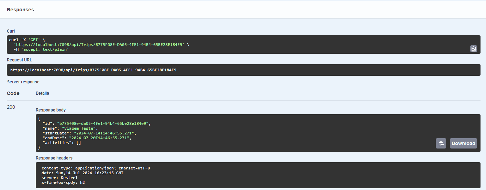

# NLW Journey Rocketseat C# 
### API para gestão de viagens e atividades :octocat:

Esse projeto disponibilizado pela ***[Rocketseat](https://rocketseat.com.br)*** através do NLW (Next Level Week) realizado na semana de 08/07/2024, traz uma **API** que é capaz de fazer a gestão de viagens, como **Adicionar**, **Consultar** e **Deletar** as viagens, além de poder inserir também Atividades vinculadas a essas viagens, e tudo isso sendo consistido em uma banco **Sqlite**.


**Pacotes Nuget utilizados:**
- Swashbuckle.AspNetCore
- FluentValidation
- Microsoft.EntityFrameworkCore
- Microsoft.EntityFrameworkCore.Sqlite

**Tela do Swagger em Debug**


### **Banco de Dados**
O banco de dados consiste duas tabelas: Trips e Activities com as seguintes estruturas:

**Trips:**
```
CREATE TABLE Trips (
    Id        TEXT NOT NULL,
    Name      TEXT NOT NULL,
    StartDate TEXT NOT NULL,
    EndDate   TEXT NOT NULL,
    PRIMARY KEY (
        Id
    )
);
```

**Activities:**
```
CREATE TABLE Activities (
    Id     TEXT    NOT NULL,
    Name   TEXT    NOT NULL,
    Date   TEXT    NOT NULL,
    Status INTEGER NOT NULL
                   DEFAULT 0,
    TripId TEXT    NOT NULL,
    PRIMARY KEY (
        Id
    ),
    FOREIGN KEY (
        TripId
    )
    REFERENCES Trips (Id) ON DELETE CASCADE
);
```

### **Viagens (Trips)**
```
 [HttpPost]
 [ProducesResponseType(typeof(ResponseShortTripJson), StatusCodes.Status201Created)]
 [ProducesResponseType(typeof(ResponseErrorsJson), StatusCodes.Status400BadRequest)]
 public IActionResult Register([FromBody] RequestRegisterTripJson request)
 {
     var useCase = new RegisterTripUseCase();

     var response = useCase.Execute(request);

     return Created(string.Empty, response);
 }
```


---
 
```
[HttpGet]
[ProducesResponseType(typeof(ResponseTripsJson), StatusCodes.Status200OK)]
[ProducesResponseType(typeof(ResponseErrorsJson), StatusCodes.Status404NotFound)]
public IActionResult GetAll()
{
    var useCase = new GetAllTripsUseCase();

    var result = useCase.Execute();

    return Ok(result);
}
```


---

```
[HttpGet]
[Route("{id}")]
[ProducesResponseType(typeof(ResponseTripJson), StatusCodes.Status200OK)]
[ProducesResponseType(typeof(ResponseErrorsJson), StatusCodes.Status404NotFound)]
public IActionResult GetById([FromRoute] Guid id)
{
    var useCase = new GetTripByIdUseCase();

    var response = useCase.Execute(id);

    return Ok(response);
}
```


---

```
[HttpDelete]
[Route("{id}")]
[ProducesResponseType(StatusCodes.Status204NoContent)]
[ProducesResponseType(typeof(ResponseErrorsJson), StatusCodes.Status404NotFound)]
public IActionResult Delete([FromRoute] Guid id)
{
    var useCase = new DeleteTripByIdUseCase();

    useCase.Execute(id);

    return NoContent();
}
```


### **Atividades (Activities)**
```
[HttpPost]
[Route("{tripId}/activity")]
[ProducesResponseType(typeof(ResponseShortTripJson), StatusCodes.Status201Created)]
[ProducesResponseType(typeof(ResponseErrorsJson), StatusCodes.Status400BadRequest)]
[ProducesResponseType(typeof(ResponseErrorsJson), StatusCodes.Status404NotFound)]
public IActionResult RegisterActivity([FromRoute] Guid tripId, [FromBody] RequestRegisterActivityJson request)
{
    var useCase = new RegisterActivityForTripUseCase();

    var response = useCase.Execute(tripId, request);

    return Created(string.Empty, response);
}
```


---

```
[HttpPut]
[Route("{tripId}/activity/{activityId}/complete")]
[ProducesResponseType(StatusCodes.Status204NoContent)]
[ProducesResponseType(typeof(ResponseErrorsJson), StatusCodes.Status404NotFound)]
public IActionResult CompleteActivity(
    [FromRoute] Guid tripId,
    [FromRoute] Guid activityId)

{
    var useCase = new CompleteActivityForTripUseCase();

    useCase.Execute(tripId, activityId);

    return NoContent();
}
```


---

```
        [HttpDelete]
        [Route("{tripId}/activity/{activityId}")]
        [ProducesResponseType(StatusCodes.Status204NoContent)]
        [ProducesResponseType(typeof(ResponseErrorsJson), StatusCodes.Status404NotFound)]
        public IActionResult DeleteActivity(
            [FromRoute] Guid tripId,
            [FromRoute] Guid activityId)

        {
            var useCase = new DeleteActivityForTripUseCase();

            useCase.Execute(tripId, activityId);

            return NoContent();
        }
```

